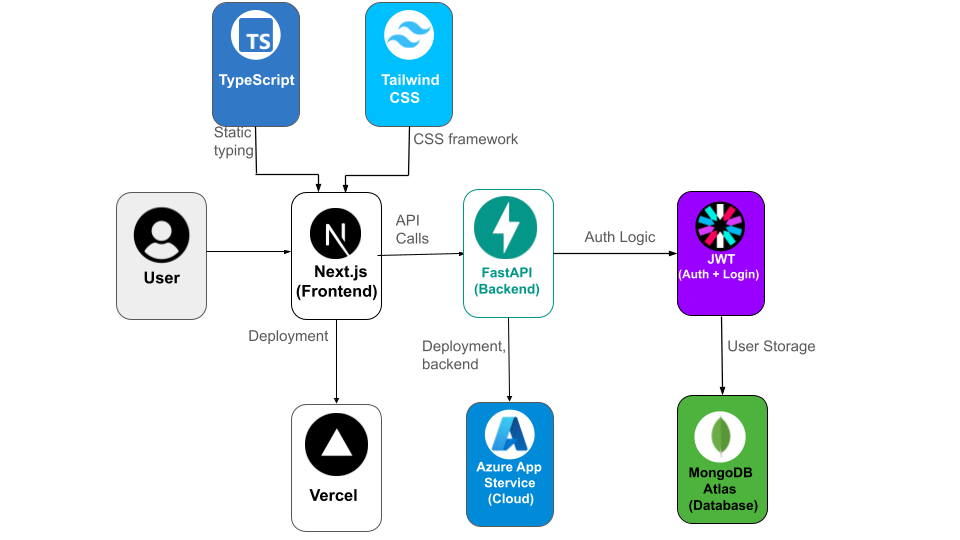

# RedRecon - Red Team Simulation Platform

A comprehensive penetration testing and security assessment platform built with FastAPI and Next.js. RedRecon provides a secure environment for practicing ethical hacking techniques and red team exercises.

## 🏗️ Architecture

- **Frontend**: Next.js 14 + TypeScript + Tailwind CSS
- **Backend**: FastAPI + Python 3.10+
- **Database**: MongoDB Atlas
- **Authentication**: JWT with bcrypt password hashing
- **Deployment**: 
  - Frontend: Vercel
  - Backend: Azure App Service

## Technology Stack


## 🚀 Features

- **User Authentication**: Secure JWT-based registration and login
- **Network Scanning**: Simulated Nmap-style port scanning and reconnaissance
- **Payload Testing**: XSS, SQLi, CSRF, LFI, and RFI payload simulation
- **Activity Logging**: Comprehensive logging of all security testing activities
- **CVE Database**: Access to vulnerability information and exploit data
- **PCAP Analysis**: Sample network traffic analysis
- **Lab Setup Guide**: Instructions for setting up penetration testing environments

## 📁 Project Structure

```
redrecon/
├── backend/                  # FastAPI application
│   ├── main.py              # Application entry point
│   ├── db.py                # MongoDB connection
│   ├── models.py            # Pydantic models
│   ├── auth.py              # JWT authentication
│   ├── routes/              # API endpoints
│   └── utils/               # Utility functions
├── frontend/                # Next.js application
│   ├── app/                 # App router pages
│   ├── components/          # React components
│   ├── lib/                 # Utility libraries
│   └── styles/              # CSS styles
├── .env.example             # Environment variables template
└── README.md
```

## 🛠️ Installation & Setup

### Prerequisites

- Python 3.10+
- Node.js 18+
- MongoDB Atlas account
- Azure account (for backend deployment)
- Vercel account (for frontend deployment)

### Backend Setup

1. **Clone the repository**
   ```bash
   git clone <repository-url>
   cd redrecon/backend
   ```

2. **Create virtual environment**
   ```bash
   python -m venv venv
   source venv/bin/activate  # On Windows: venv\Scripts\activate
   ```

3. **Install dependencies**
   ```bash
   pip install -r requirements.txt
   ```

4. **Set up environment variables**
   ```bash
   cp .env.example .env
   # Edit .env with your MongoDB URI and JWT secret
   ```

5. **Run the development server**
   ```bash
   uvicorn main:app --reload
   ```

The API will be available at `http://localhost:8000`

### Frontend Setup

1. **Navigate to frontend directory**
   ```bash
   cd ../frontend
   ```

2. **Install dependencies**
   ```bash
   npm install
   ```

3. **Set up environment variables**
   ```bash
   cp .env.example .env.local
   # Edit .env.local with your API URL
   ```

4. **Run the development server**
   ```bash
   npm run dev
   ```

The frontend will be available at `http://localhost:3000`

## 🔐 Environment Variables

### Backend (.env)
```bash
MONGO_URI=mongodb+srv://<USERNAME>:<PASSWORD>@<CLUSTER>.mongodb.net/redrecon?retryWrites=true&w=majority
JWT_SECRET_KEY=your-super-secure-jwt-secret-key
```

### Frontend (.env.local)
```bash
NEXT_PUBLIC_API_URL=http://localhost:8000
```

## 🚀 Deployment

### Backend (Azure App Service)

1. **Create Azure App Service**
   - Choose Linux + Python 3.10
   - Set startup command: `gunicorn -w 4 -k uvicorn.workers.UvicornWorker main:app`

2. **Configure environment variables in Azure**
   - Add `MONGO_URI` and `JWT_SECRET_KEY` in Configuration settings

3. **Deploy via GitHub Actions or ZIP deployment**

### Frontend (Vercel)

1. **Connect GitHub repository to Vercel**

2. **Set environment variables**
   ```bash
   NEXT_PUBLIC_API_URL=https://your-backend-url.azurewebsites.net
   ```

3. **Deploy automatically via Git push**

## 📚 API Documentation

Once the backend is running, visit `http://localhost:8000/docs` for interactive API documentation powered by FastAPI and Swagger UI.

### Key Endpoints

- `POST /api/register` - User registration
- `POST /api/login` - User authentication
- `GET /api/me` - Get current user profile
- `POST /api/scan` - Perform network scan
- `POST /api/payload` - Test security payloads
- `GET /api/logs` - Retrieve activity logs
- `GET /api/cves` - Get CVE information
- `GET /api/pcap` - Get PCAP analysis data
- `GET /api/setup` - Get lab setup guide

## 🔒 Security Features

- **JWT Authentication**: Secure token-based authentication
- **Password Hashing**: bcrypt for secure password storage
- **CORS Protection**: Configured for production domains
- **Input Validation**: Pydantic models for API validation
- **Rate Limiting**: Built-in protection against abuse

## 🧪 Testing

### Backend Testing
```bash
cd backend
python -m pytest
```

### Frontend Testing
```bash
cd frontend
npm run test
```

## 📝 Usage Examples

### Network Scanning
```bash
curl -X POST "http://localhost:8000/api/scan" \
     -H "Authorization: Bearer YOUR_JWT_TOKEN" \
     -H "Content-Type: application/json" \
     -d '{"target": "192.168.1.1"}'
```

### Payload Testing
```bash
curl -X POST "http://localhost:8000/api/payload" \
     -H "Authorization: Bearer YOUR_JWT_TOKEN" \
     -H "Content-Type: application/json" \
     -d '{
       "payload_type": "xss",
       "target_url": "https://example.com",
       "payload": "<script>alert(1)</script>"
     }'
```

## 🤝 Contributing

1. Fork the repository
2. Create a feature branch (`git checkout -b feature/amazing-feature`)
3. Commit your changes (`git commit -m 'Add some amazing feature'`)
4. Push to the branch (`git push origin feature/amazing-feature`)
5. Open a Pull Request

## ⚖️ Legal Disclaimer

This platform is designed for educational purposes and authorized security testing only. Users are responsible for ensuring they have proper authorization before testing any systems. The developers are not responsible for any misuse of this platform.

## 📄 License

This project is licensed under the MIT License - see the LICENSE file for details.

## 🆘 Support

For support, please open an issue on GitHub or contact the development team.
